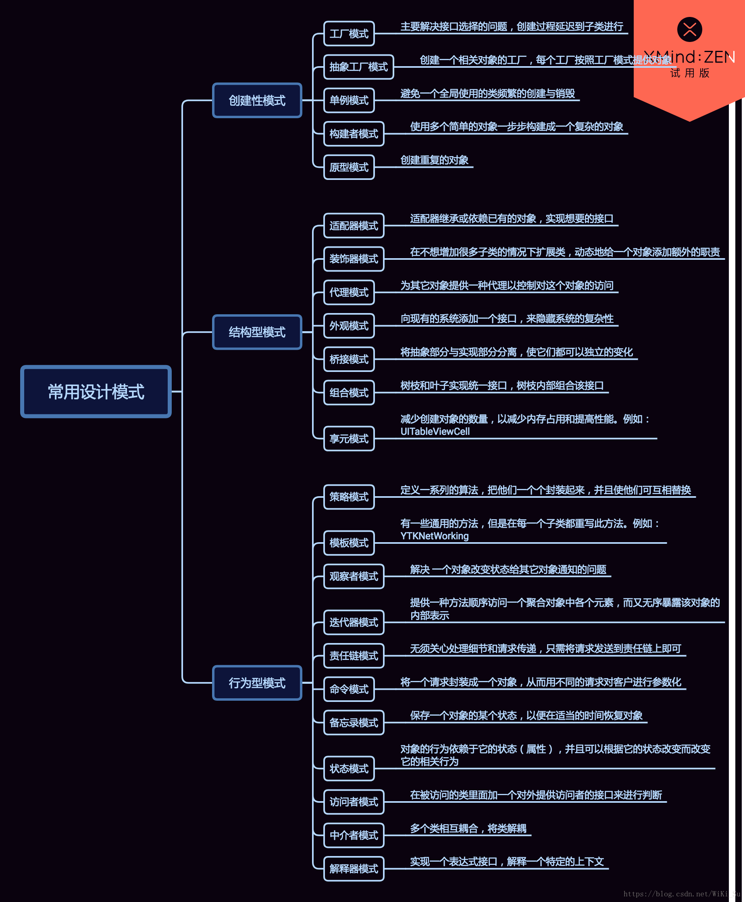

# 24种设计模式(24 Design Pattern)

***
## 一.创建型模式
### 1.单例模式(Singleton)
单例模式（Singleton Pattern）是 Java 中最简单的设计模式之一。这种类型的设计模式属于创建型模式，它提供了一种创建对象的最佳方式。

这种模式涉及到一个单一的类，该类负责创建自己的对象，同时确保只有单个对象被创建。这个类提供了一种访问其唯一的对象的方式，可以直接访问，不需要实例化该类的对象。

###### 意图：保证一个类仅有一个实例，并提供一个访问它的全局访问点。
###### 主要解决：一个全局使用的类频繁地创建与销毁。
###### 何时使用：当您想控制实例数目，节省系统资源的时候。
###### 如何解决：判断系统是否已经有这个单例，如果有则返回，如果没有则创建。
###### 关键代码：构造函数是私有的。

- 懒汉式(线程不安全、是懒加载、不能防止反射构建)
- 饿汉式(线程安全、不是懒加载、能防止反射构建)
- 双重锁检验(线程安全、是懒加载、不能防止反射构建)
- 静态内部类(线程安全、是懒加载、不能防止反射构建)
- 枚举(线程安全、不是懒加载、能防止反射构建)

### 2.工厂方法模式(Factory Method)
工厂模式（Factory Pattern）是 Java 中最常用的设计模式之一。这种类型的设计模式属于创建型模式，它提供了一种创建对象的最佳方式。

在工厂模式中，我们在创建对象时不会对客户端暴露创建逻辑，并且是通过使用一个共同的接口来指向新创建的对象。

工厂模式，可以理解为：有了很多个工厂方法，自己需要哪一个产品，就调用当前产品的工厂方法，获取相应的具体实例。
###### 意图：定义一个创建对象的接口，让其子类自己决定实例化哪一个工厂类，工厂模式使其创建过程延迟到子类进行。
###### 主要解决：主要解决接口选择的问题。
###### 何时使用：我们明确地计划不同条件下创建不同实例时。
###### 如何解决：让其子类实现工厂接口，返回的也是一个抽象的产品。
###### 关键代码：创建过程在其子类执行。

### 3.抽象工厂模式(Abstract Factory)
抽象工厂模式（Abstract Factory Pattern）是围绕一个超级工厂创建其他工厂。该超级工厂又称为其他工厂的工厂。这种类型的设计模式属于创建型模式，它提供了一种创建对象的最佳方式。

在抽象工厂模式中，接口是负责创建一个相关对象的工厂，不需要显式指定它们的类。每个生成的工厂都能按照工厂模式提供对象。

###### 意图：提供一个创建一系列相关或相互依赖对象的接口，而无需指定它们具体的类。
###### 主要解决：主要解决接口选择的问题。
###### 何时使用：系统的产品有多于一个的产品族，而系统只消费其中某一族的产品。
###### 如何解决：在一个产品族里面，定义多个产品。
###### 关键代码：在一个工厂里聚合多个同类产品。

### 4.建造者模式(Builder)
对于建造者模式而已，它主要是将一个复杂对象的构建与表示分离，使得同样的构建过程可以创建不同的表示。适用于那些产品对象的内部结构比较复杂。

建造者模式将复杂产品的构建过程封装分解在不同的方法中，使得创建过程非常清晰，能够让我们更加精确的控制复杂产品对象的创建过程，同时它隔离了复杂产品对象的创建和使用，使得相同的创建过程能够创建不同的产品。但是如果某个产品的内部结构过于复杂，将会导致整个系统变得非常庞大，不利于控制，同时若几个产品之间存在较大的差异，则不适用建造者模式，毕竟这个世界上存在相同点大的两个产品并不是很多，所以它的使用范围有限。
###### 意图：将一个复杂的构建与其表示相分离，使得同样的构建过程可以创建不同的表示。
###### 主要解决：主要解决在软件系统中，有时候面临着”一个复杂对象”的创建工作，其通常由各个部分的子对象用一定的算法构成；由于需求的变化，这个复杂对象的各个部分经常面临着剧烈的变化，但是将它们组合在一起的算法却相对稳定。
###### 何时使用：一些基本部件不会变，而其组合经常变化的时候。
###### 如何解决：将变与不变分离开。
###### 关键代码：建造者：创建和提供实例，导演：管理建造出来的实例的依赖关系。

- 静态内部类方式实现零件无序装配话构造
- Client、Director、Builder和Product形成的建造者模式

### 5.原型模式(Prototype)
### 6.多例模式(Multiton)
***
## 二.结构型模式
### 1.适配器模式(Adapter)
### 2.桥接模式(Bridge)
### 3.组合模式(Composite)
### 4.装饰模式(Decorator)
### 5.外观模式(Facade)
### 6.亨元模式(Flyweight)
### 7.代理模式(Proxy)
***
## 三.行为型模式
### 1.访问者模式(Visitor)
### 2.模板模式(Template)
### 3.策略模式(Strategy)
### 4.状态模式(State)
### 5.观察者模式(Observer)
### 6.备忘录模式(Memento)
### 7.中介者模式(Mediator)
### 8.迭代器模式(Iterator)
### 9.解释器模式(Interpreter)
### 10.命令模式(Command)
### 11.责任链模式(Chain of Responsibility)