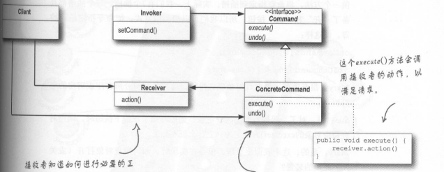

### 代码案例
设计一个遥控器，可以控制开灯，开门，放歌，放电视按钮功能。
***
### 命令模式定义
将请求封装成对象，这可以使用不同的请求，队列或者日志请求来参数化其他对象，命令模式也可以支持撤销操作。

具体的命令都需要实现命令接口的excute()方法，都包含有一个接收者，如LightCommand类实现Command接口，包含一个Light类的引用
excute()方法调用Light的相应方法。

***
### 设计原则
开放-关闭原则，对扩展开放，对修改关闭。