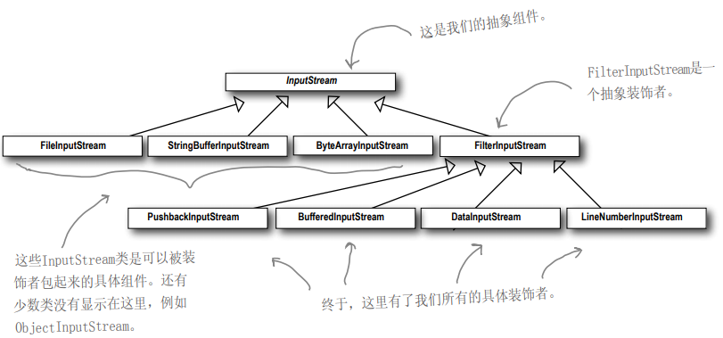

### 代码案例
改装车，在原有车的基础上你可能会给车刷别的颜色的漆，或者加装尾翼，或者增加灯等需求。
***
### 装饰器模式定义
动态地将责任附加到对象上，若要扩展功能，装饰者提供了比继承更有弹性的替代方案。

装饰者和被装饰者有相同的超类ICar。

可以用多个装饰者包装一个对象。

由于拥有共同的超类，所以在任何需要原对象的地方可以用装饰过的对象替代。

装饰者可以在被装饰者的之前或之后增加行为，以达到特定的目的。

对象可以在任何时候被装饰，所以可以在运行时动态的，不限量的用你喜欢的装饰者装饰对象。

java中的io使用了装饰器模式
***

***
### 设计原则
开放-关闭原则，对扩展开放，对修改关闭。